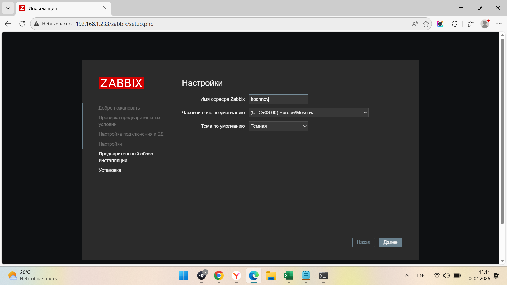
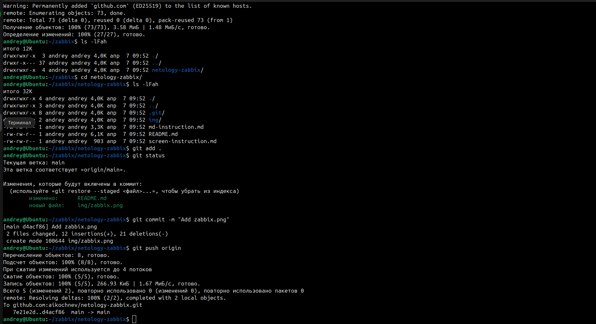
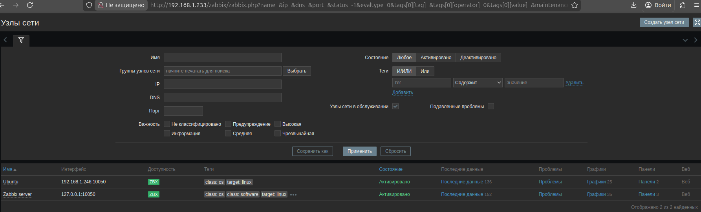
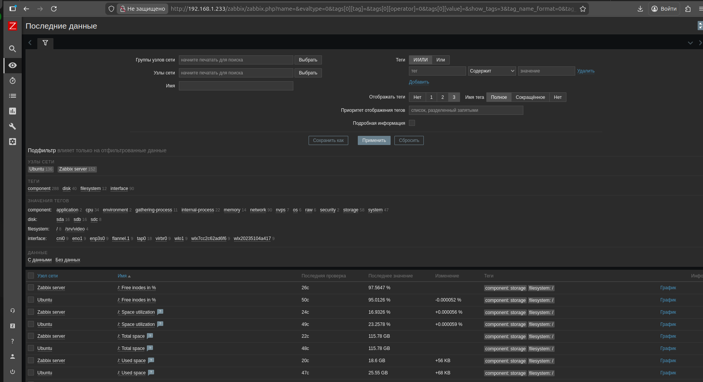
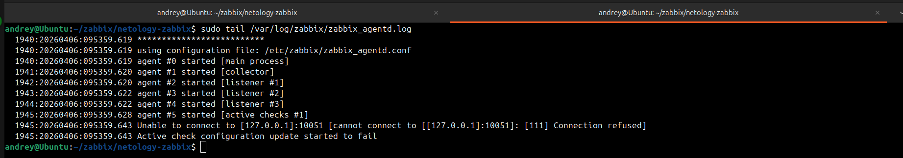
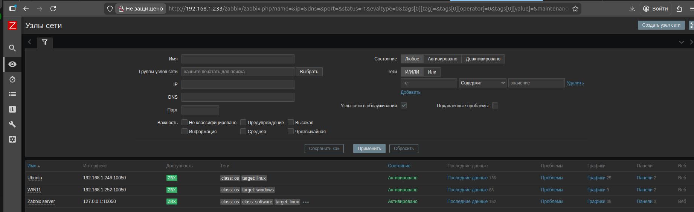
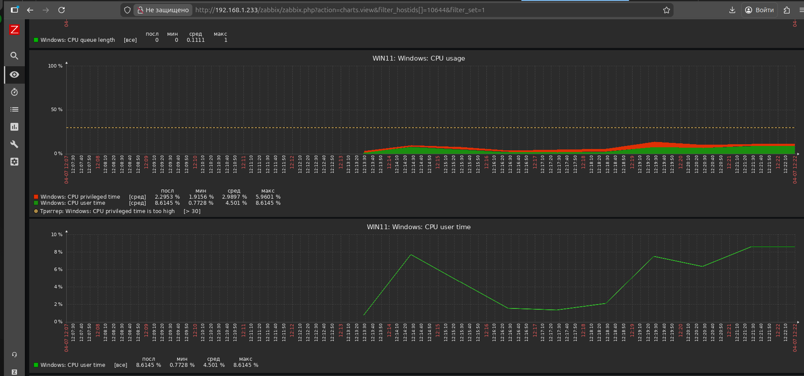

# Домашнее задание к занятию "`Zabbix`" - `Кочнев Андрей`


### Инструкция по выполнению домашнего задания

   1. Сделайте `fork` данного репозитория к себе в Github и переименуйте его по названию или номеру занятия, например, https://github.com/имя-вашего-репозитория/git-hw или  https://github.com/имя-вашего-репозитория/7-1-ansible-hw).
   2. Выполните клонирование данного репозитория к себе на ПК с помощью команды `git clone`.
   3. Выполните домашнее задание и заполните у себя локально этот файл README.md:
      - впишите вверху название занятия и вашу фамилию и имя
      - в каждом задании добавьте решение в требуемом виде (текст/код/скриншоты/ссылка)
      - для корректного добавления скриншотов воспользуйтесь [инструкцией "Как вставить скриншот в шаблон с решением](https://github.com/netology-code/sys-pattern-homework/blob/main/screen-instruction.md)
      - при оформлении используйте возможности языка разметки md (коротко об этом можно посмотреть в [инструкции  по MarkDown](https://github.com/netology-code/sys-pattern-homework/blob/main/md-instruction.md))
   4. После завершения работы над домашним заданием сделайте коммит (`git commit -m "comment"`) и отправьте его на Github (`git push origin`);
   5. Для проверки домашнего задания преподавателем в личном кабинете прикрепите и отправьте ссылку на решение в виде md-файла в вашем Github.
   6. Любые вопросы по выполнению заданий спрашивайте в чате учебной группы и/или в разделе “Вопросы по заданию” в личном кабинете.

Желаем успехов в выполнении домашнего задания!

### Дополнительные материалы, которые могут быть полезны для выполнения задания

1. [Руководство по оформлению Markdown файлов](https://gist.github.com/Jekins/2bf2d0638163f1294637#Code)

---

### Задание 1

`Установил Zabbix сервер на локальный сервер Ubuntu 22.04`

1. `Установка сервера на 192.168.1.233`
2. `Создание репозитория Zabbix`
3. `Работа с репозиторием и отправка работы на github`

```
Поле для вставки кода...

wget https://repo.zabbix.com/zabbix/7.4/release/ubuntu/pool/main/z/zabbix-release/zabbix-release_latest_7.4+ubuntu22.04_all.deb
dpkg -i zabbix-release_latest_7.4+ubuntu22.04_all.deb
apt update
apt install zabbix-server-pgsql zabbix-frontend-php php8.1-pgsql zabbix-apache-conf zabbix-sql-scripts
sudo -u postgres createuser --pwprompt zabbix
sudo -u postgres createdb -O zabbix zabbix
zcat /usr/share/zabbix/sql-scripts/postgresql/server.sql.gz | sudo -u zabbix psql zabbix
sudo nano /etc/zabbix/zabbix_server.conf
   DBPassword=12345
systemctl restart zabbix-server apache2
systemctl enable zabbix-server apache2
```

`При необходимости прикрепитe сюда скриншоты



`

---

### Задание 2

`Zabbix Agent установлены на две машины`

1. `Zabbix Agent установлен на 192.168.1.233 - сервер`
2. `Zabbix Agent установлен на 192.168.1.246 - рабочий пк`

```
Поле для вставки кода...
wget https://repo.zabbix.com/zabbix/7.4/release/ubuntu/pool/main/z/zabbix-release/zabbix-release_latest_7.4+ubuntu24.04_all.deb
dpkg -i zabbix-release_latest_7.4+ubuntu24.04_all.deb
apt update
apt install zabbix-agent
systemctl restart zabbix-agent
systemctl enable zabbix-agent
```

`При необходимости прикрепитe сюда скриншоты





`

---

### Задание 3

`Zabbix Agent установлены на Windows 11`

1. `Zabbix Agent установлен на 192.168.1.252 - windows 11`

`При необходимости прикрепитe сюда скриншоты



`
